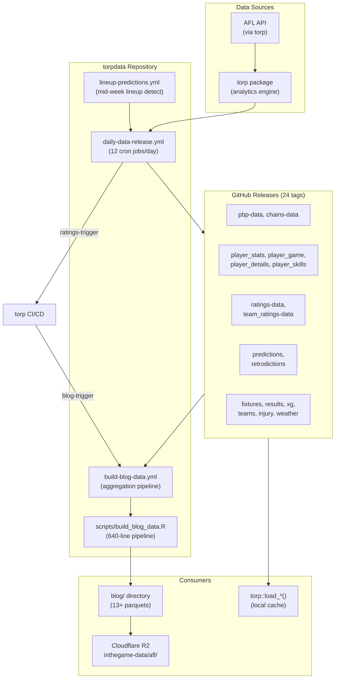
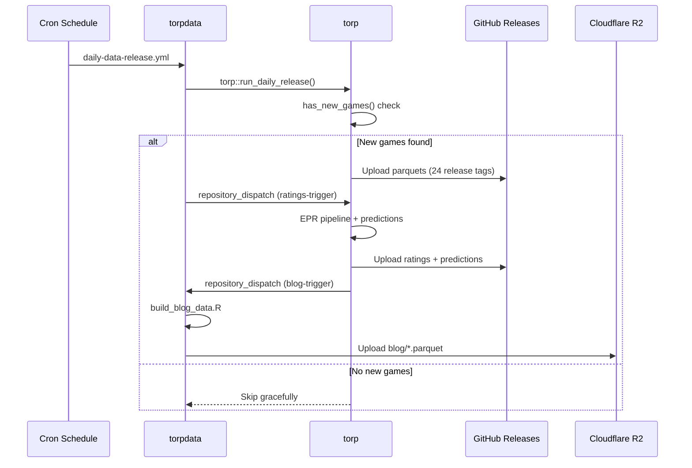

# torpdata Architecture

## Overview

**torpdata** is a data distribution hub for the torpverse AFL analytics ecosystem. It has no R package code -- instead it orchestrates data flow between the `torp` analytics engine, GitHub Releases (the data bus), Cloudflare R2 (web delivery), and the inthegame-blog.

torpdata serves three roles:
1. **Release Manager** -- Orchestrates daily AFL data capture from torp into 24 versioned GitHub Releases
2. **Blog Aggregator** -- Transforms dispersed release assets into cohesive, normalized parquets
3. **Distribution Point** -- Feeds data to offline caches, Cloudflare R2, and direct API consumers

## Architecture Diagram



## Data Flow



## Components

### GitHub Releases (24 Tags)

**Purpose**: Versioned data storage using GitHub Releases as a data bus. Each tag holds per-season parquet files uploaded by `torp::save_to_release()`.

| Tag | Contents | Update Frequency |
|-----|----------|-----------------|
| `pbp-data` | Play-by-play events (~320K rows/season) | Daily (game days) |
| `chains-data` | Ball movement chains (~160K rows/season) | Daily (game days) |
| `fixtures-data` | Match schedules | Daily |
| `results-data` | Match results and scores | Daily (game days) |
| `teams-data` | Team lineups/squads | Daily + mid-week |
| `player_stats-data` | Per-player game statistics (~10K rows/season) | Daily (game days) |
| `player_game-data` | Box-score stats per game | Daily (game days) |
| `player_details-data` | Bio data (~800 rows/season) | Daily |
| `ratings-data` | Player TORP ratings (full career, ~113K rows) | Daily (game days) |
| `team_ratings-data` | Team-level TORP aggregates | Daily (game days) |
| `player_game_ratings-data` | Per-game TORP ratings (~18.5K rows/season) | Daily (game days) |
| `player_season_ratings-data` | Season aggregates | Daily (game days) |
| `player_skills-data` | Skill metrics | Daily (game days) |
| `predictions` | Match predictions (2023+) | Daily (game days) |
| `retrodictions` | Backfill predictions | Ad-hoc |
| `xg-data` | Expected goals | Daily (game days) |
| `injury-data` | Current injury list | Daily |
| `ep_wp_chart-data` | Lightweight PBP for charting | Daily (game days) |
| `weather-data` | Historical weather | Ad-hoc |
| `psr-data` | PSR ratings | Daily (game days) |
| `ps-data` | Player stat ratings | Daily (game days) |
| `reference-data` | Reference tables | Ad-hoc |

---

### Daily Data Release Workflow

**Purpose**: Detect new AFL games and push updated data to releases. Triggers the downstream ratings pipeline.

**File**: `.github/workflows/daily-data-release.yml`

**Schedule** (12 cron jobs covering all AFL game times, AEST):
- Thursday: 10:30 PM, 11:30 PM
- Friday: 6 PM, 10:30 PM, 11:30 PM
- Saturday: 3:30 PM, 5:30 PM, 8 PM, 10:30 PM, 11:30 PM
- Sunday: 3:30 PM, 5:30 PM, 8 PM, 10:30 PM
- Monday: 6 PM, 8 PM
- Daily safety net: 2 AM

**Manual Inputs**: `force_release` (skip new-games check), `rebuild_aggregates` (full rebuild)

**Steps**:
1. Run `torp::run_daily_release(force)` -- returns `'full'`, `'team_only'`, or `'none'`
2. Verify release freshness (critical files updated within 24 hours)
3. Optional: rebuild aggregated files
4. Dispatch `ratings-trigger` to torp with season/round payload
5. On failure: auto-create GitHub issue with troubleshooting steps

**Key Mechanism**: R script writes to `$GITHUB_OUTPUT` via `cat(file=Sys.getenv('GITHUB_OUTPUT'))` to avoid stdout contamination from `devtools::load_all()`.

---

### Lineup Predictions Workflow

**Purpose**: Detect mid-week lineup changes and trigger prediction updates.

**File**: `.github/workflows/lineup-predictions.yml`

**Schedule**: Wed/Thu 7-10 PM AEST (4 cron jobs) + Friday 8 AM AEST

**Steps**:
1. Run `torp::has_new_team_data()` -- returns TRUE/FALSE
2. If TRUE: run `torp::run_daily_release()` in team-only mode
3. Dispatch `ratings-trigger` to torp

---

### Blog Data Pipeline

**Purpose**: Aggregate release data into blog-ready parquets; upload to Cloudflare R2 for the inthegame-blog.

**File**: `.github/workflows/build-blog-data.yml` + `scripts/build_blog_data.R` (640 lines)

**Trigger**: Manual dispatch or `blog-trigger` repository dispatch from torp

**Pipeline Stages** (in `build_blog_data.R`):

| Stage | Output File | Description |
|-------|------------|-------------|
| Player Ratings | `ratings.parquet` | All player TORP ratings (2021+), handles column name evolution |
| Team Ratings | `team-ratings.parquet` | Latest round team ratings (requires >= 18 teams) |
| Predictions | `predictions.parquet` | All match predictions (2023+), backfills with retrodictions, handles legacy vs current format |
| Player Details | `player-details.parquet` | Bio data with naming evolution handling (camelCase -> snake_case) |
| Game Logs | `game-logs.parquet` | Per-game TORP ratings (2021+), includes PSV/OSV/DSV if available |
| Game Stats | `game-stats.parquet` | Raw box-score stats (last 2 seasons, optional) |
| Shot Charts | `shots.parquet` | Shot attempts with coordinates, xG, xScore (optional) |
| xScore Enrichment | (joins to predictions) | Per-match xScore totals from shots |
| Match Events | `match-events-YYYY.parquet` | Per-season EPV delta events (optional) |
| Chain Data | `chains-YYYY.parquet` | Per-season chain actions (optional) |
| Team Lineups | `teams-YYYY.parquet` | Per-season lineup data (optional) |
| Simulations | `simulations.parquet` | 3000-sim Monte Carlo season projection (optional, requires torp) |
| Injuries | `injuries.parquet` | Current injury list (optional) |
| Player Skills | `player-skills.parquet` | Skill metrics (optional) |

**Validation**: Core datasets must be non-empty (ratings > 100 rows, teams >= 18, preds > 0, details > 0, game_logs > 0). Optional datasets warn but don't block.

**Upload**: All `blog/*.parquet` files pushed to Cloudflare R2 bucket `inthegame-data` with prefix `afl/` via npm wrangler CLI.

---

### Local Data Cache

**Purpose**: Gitignored local cache for development and `torp::load_*()` fast-path.

**Location**: `torpdata/data/` (auto-detected by torp via workspace structure)

**Contents**: ~711 files (387 parquet + 321 legacy RDS), per-round and aggregated data (2021-2026)

**Naming Convention**: `{type}_{season}_{round}.parquet` (e.g., `pbp_data_2025_01.parquet`) and `{type}_{season}_all.parquet` (aggregated)

**Populated by**: `torp::download_torp_data()` and `torp::save_locally()`

---

## Directory Structure

```
torpdata/
├── .github/workflows/
│   ├── daily-data-release.yml    # Daily data capture (12 cron jobs)
│   ├── build-blog-data.yml       # Blog aggregation + R2 upload
│   └── lineup-predictions.yml    # Mid-week lineup detection
├── scripts/
│   └── build_blog_data.R         # 640-line aggregation pipeline
├── blog/                         # Output: blog-ready parquets
├── source/                       # Intermediate: parquets fetched from releases
├── data/                         # Local cache (gitignored)
├── README.md
├── CLAUDE.md                     # Developer guide (gitignored)
├── LICENSE                       # MIT
└── torpdata.Rproj
```

## Secrets

| Secret | Purpose |
|--------|---------|
| `WORKFLOW_PAT` | GitHub PAT with write access to releases + cross-repo dispatch |
| `CLOUDFLARE_R2_TOKEN` | API token for R2 uploads |
| `CLOUDFLARE_ACCOUNT_ID` | Cloudflare account ID |
| `GITHUB_TOKEN` | Auto-provided by GitHub Actions |

## Glossary

| Term | Definition |
|------|------------|
| **Release tag** | A GitHub Release used as versioned data storage (e.g., `pbp-data`) |
| **Data bus** | The GitHub Releases system acting as a pub/sub layer between torp and consumers |
| **Blog parquet** | Aggregated, normalized parquet files optimized for the inthegame-blog frontend |
| **R2** | Cloudflare R2 object storage used for low-latency blog data delivery |
| **Retrodictions** | Backfilled predictions for rounds that occurred before the prediction pipeline was running |
| **ratings-trigger** | Repository dispatch event sent from torpdata to torp after new data is released |
| **blog-trigger** | Repository dispatch event sent from torp to torpdata after ratings/predictions are computed |
